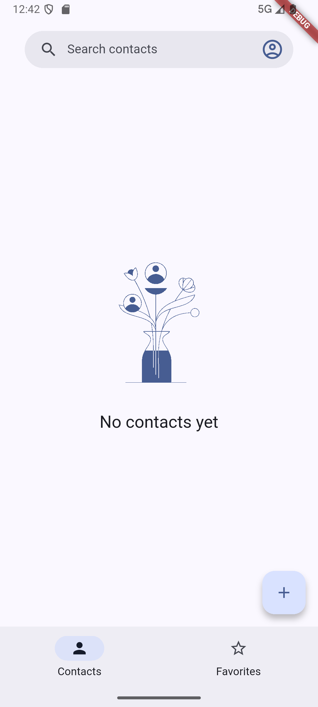
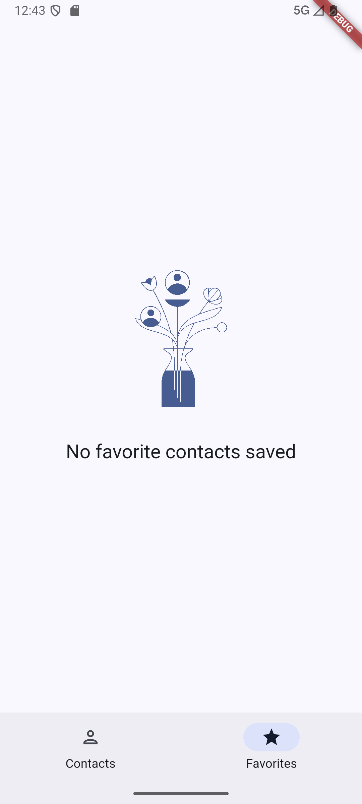
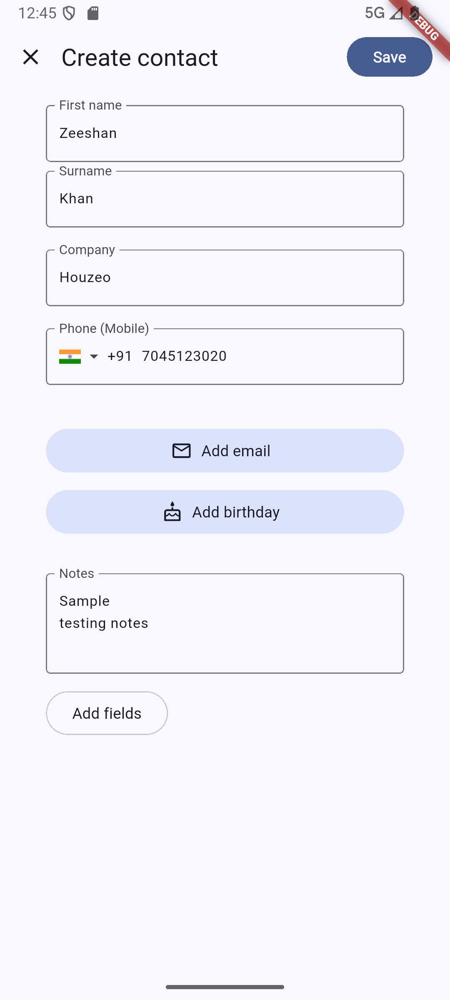
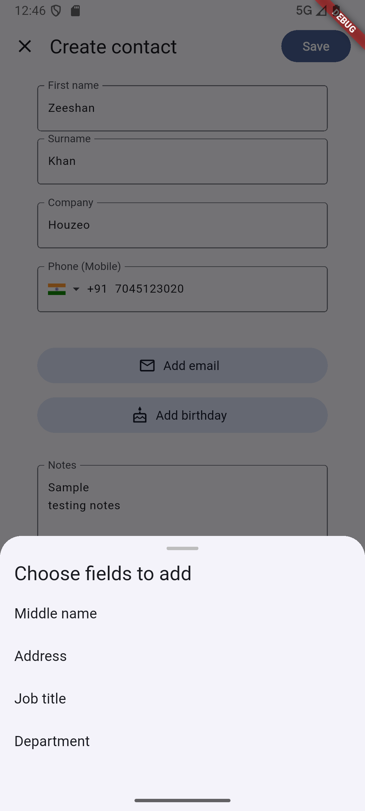
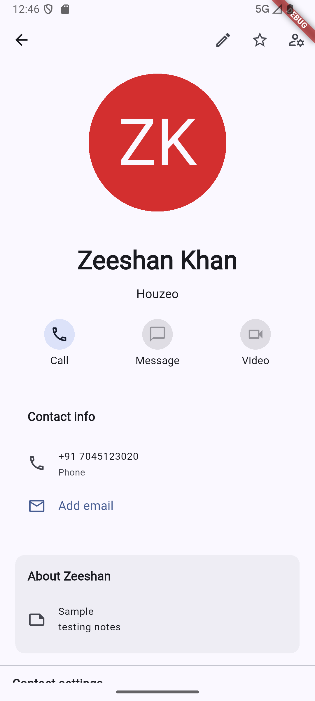
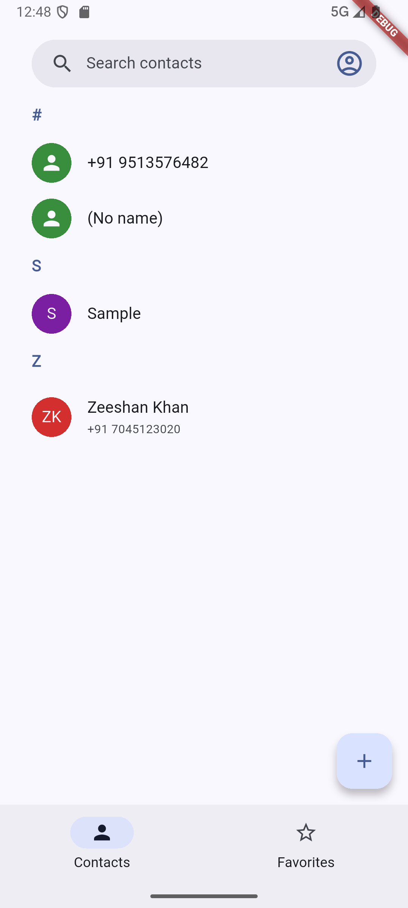
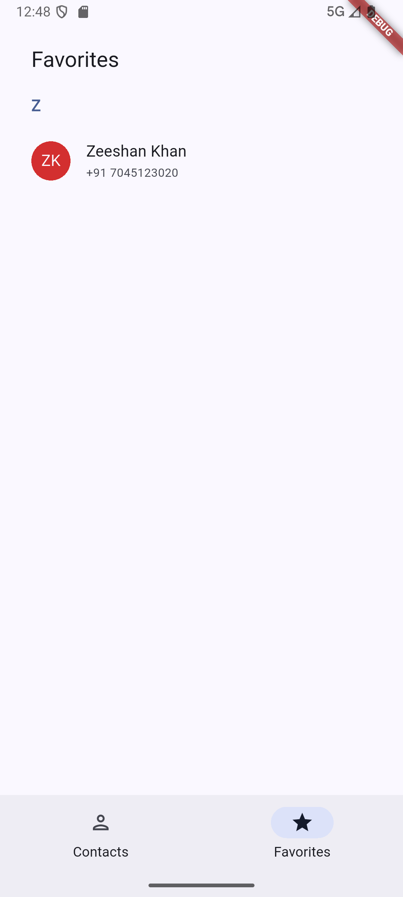
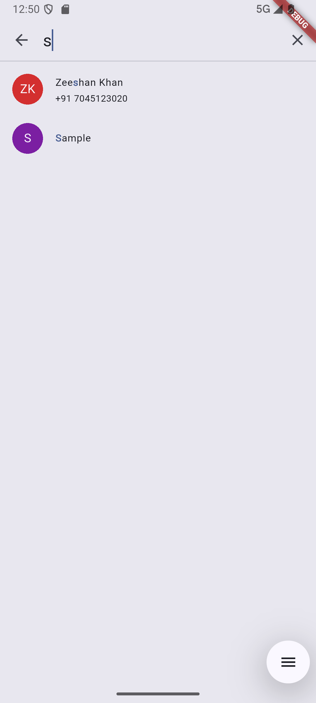

# Google Contacts Clone (Flutter)

A modern Flutter application inspired by Google Contacts. This app enables users to manage their contacts effectively with a clean, intuitive Material UI and feature-rich experience. Designed for both learning and real-world usability.

> ⚠️ **Note:** This project is for educational purposes and is not affiliated with Google.

---

## ✨ Features

### 📇 Contact Management

- Add, edit, and delete contacts with full details
- Fields include: name, phone, email, address, company, job title, department, birthday, notes, and more
- Mark/unmark contacts as favorites

### 🔍 Search & Organization

- Search contacts by name or phone number
- Contacts are grouped alphabetically for easy browsing

### 📱 Contact Details

- View full contact profiles
- Initiate phone calls directly from the app

### 💡 User Experience

- Fully responsive UI for Android and iOS
- Built using Material UI with light and dark mode support
- Smooth animations and intuitive transitions

### 🌐 Device & Data Integration

- Call integration using native phone functionality
- Local device storage using **SQLite** for offline-first contact management

---

## 🏠 Home Screen Navigation

- Bottom navigation bar with two primary tabs:
  - **Contacts**: Displays all added contacts in a list format
  - **Favorites**: Shows contacts marked as favorites for quick access

---

## Installation

### Prerequisites

- [Flutter SDK](https://docs.flutter.dev/get-started/install)
- Android Studio or VS Code (recommended)
- An Android or iOS device/emulator

### Steps

1. **Clone the repository**

   ```sh
   git clone https://github.com/zeeshan2423/google-contacts.git
   cd google-contacts
   ```

2. **Clone the repository**

   ```dart
   flutter pub get
   ```

3. **Configure platform-specific settings**

   - For Android: Ensure Google Services and permissions are set in `android/app/build.gradle` and AndroidManifest.xml
   - For iOS: Update permissions in `ios/Runner/Info.plist`

4. **Run the app**
   ```dart
   flutter run
   ```

## Screenshots

<p align="center">
  
  
  
</p>

<p align="center">
  
  
  
</p>

<p align="center">
  
  
  
</p>

## Usage

- Add Contact: Tap the "+" icon, fill in the form, and save
- Edit Contact: Open a contact and tap the edit icon
- Delete Contact: Tap delete and confirm action
- Favorite Contact: Tap the star icon on a contact profile
- Search Contact: Use the search bar to quickly locate contacts
- Call Contact: Tap the phone icon to place a call directly

## Project Structure

```bash
lib/
├── core/               # Constants, themes, helpers
├── features/
│   └── navigation/
│       └── routes/
│           └── contacts/     # Contact-related screens and logic
│               └── routes/
│                   └── create_edit_contact/ # Crete contact-related screens and logic
│                   └── contact_detail/  # Contact detail-related screens and logic
│           └── favorites/
├── assets/            # Images and static assets
android/               # Android-specific code
ios/                   # iOS-specific code
```

## UI/UX Guidelines

- Designed following Material Design principles
- Ensures accessibility, responsiveness, and visual consistency
- Smooth page transitions, animations, and button feedback

## Contributing

Contributions are welcome! Please open issues or submit pull requests for improvements and bug fixes.
